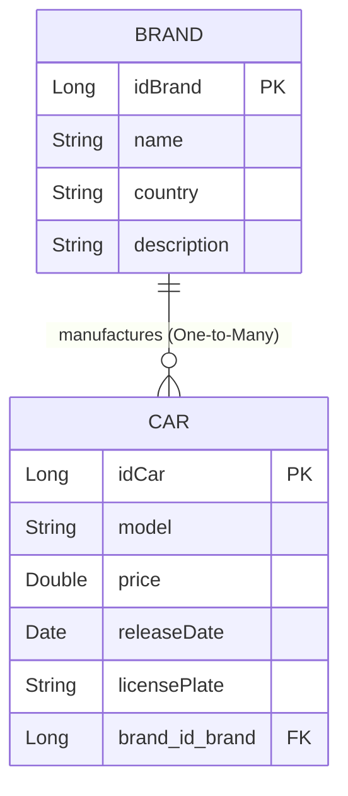

# CarHub — Mini Projet Fullstack (Sprint 01)
### Architecture : Spring Boot 3 + Angular 20 + Tailwind CSS + MySQL Docker

Ce projet a été développé dans le cadre du cours **"Développez Full Stack avec Spring Boot 3 et Angular" (Sections 2, 3 et 4)**.

---

## 1. Respect des Spécifications et Consignes

| Consigne de l'Enseignant | Réalisation dans ce Projet |
| :--- | :--- |
| **Deux entités associées en One-To-Many** | `Brand` (1) ───< (N) `Car` |
| **Attributs de types variés** | `Long` (`idCar`, `idBrand`), `String` (`model`, `licensePlate`, `name`, `country`), `Double` (`price`), `Date` (`releaseDate`) |
| **Noms d'attributs distincts du cours** | `idCar`, `model`, `price`, `releaseDate`, `licensePlate` (au lieu de `nomProduit`, `prixProduit`, `dateCreation`) |
| **Variables métier dédiées** | `cars` (et non `prods`), `brands` (et non `cats`) |
| **Nom du projet Spring Boot** | `cars_proj` |
| **Style UI** | Tailwind CSS avec design moderne, responsive et élégant |
| **Base de Données** | MySQL 8.4 conteneurisé avec Docker Compose (`mydatabase`) |

---

## 2. Modèle de Données & Relations



---

## 3. Structure du Répertoire Monorepo

```text
SOA/
├── docker-compose.yml          # Déploiement MySQL 8.4 + phpMyAdmin
├── .gitignore                  # Exclusion node_modules, target, etc.
├── cars_proj/                  # Backend Spring Boot 3.3.4 (Java 21)
│   ├── pom.xml
│   ├── src/main/java/com/example/cars/
│   │   ├── entities/           # Car.java, Brand.java
│   │   ├── repos/              # CarRepository.java, BrandRepository.java (Requêtes Section 2)
│   │   ├── service/            # CarService.java, CarServiceImpl.java
│   │   ├── restcontrollers/    # CarRESTController.java (@CrossOrigin, Endpoints REST)
│   │   └── CarsProjApplication.java  # Seeder de données au démarrage (CommandLineRunner)
│   └── src/test/java/com/example/cars/
│       └── CarsProjApplicationTests.java  # 10 Tests JUnit réussis (Section 2)
│
└── cars-frontend/              # Frontend Angular 20 (Tailwind CSS)
    ├── package.json
    ├── tailwind.config.js
    └── src/app/
        ├── model/              # car.model.ts, brand.model.ts
        ├── services/           # car.service.ts (Appels REST HttpClient)
        ├── cars/               # Composant d'affichage (Tableau, Filtre par marque, Recherche)
        ├── add-car/            # Formulaire d'ajout avec sélecteur dynamique de marque
        └── update-car/         # Formulaire de modification
```

---

## 4. Endpoints API REST (Spring Boot - Port 8082)

| Méthode | Endpoint | Description |
| :--- | :--- | :--- |
| `GET` | `/api/all` | Récupérer la liste complète des voitures avec leur marque |
| `GET` | `/api/{id}` | Consulter les détails d'une voiture par son ID |
| `POST` | `/api` | Ajouter une nouvelle voiture |
| `PUT` | `/api` | Modifier les caractéristiques d'une voiture |
| `DELETE` | `/api/{id}` | Supprimer une voiture par son ID |
| `GET` | `/api/carsbrand/{idBrand}` | Filtrer les voitures selon une marque spécifique |
| `GET` | `/api/carsbymodel/{keyword}` | Rechercher les voitures par mot-clé du modèle |
| `GET` | `/api/brands` | Lister toutes les marques pour le sélecteur |

---

## 5. Instructions d'Exécution

### Étape 1 : Démarrer la Base de Données avec Docker
Dans le dossier racine `SOA` :
```bash
docker compose up -d
```
- **MySQL** : `localhost:3306` (Base : `mydatabase`, Utilisateur : `root`, sans mot de passe)
- **phpMyAdmin** : `http://localhost:8080`

### Étape 2 : Démarrer le Backend Spring Boot
Dans le dossier `cars_proj` :
```bash
# Windows
.\mvnw.cmd spring-boot:run

# Linux / Mac
./mvnw spring-boot:run
```
L'API démarre sur : **`http://localhost:8082`**
Des données de test (BMW, Audi, Mercedes-Benz, Porsche) sont automatiquement initialisées dans MySQL au premier lancement.

### Étape 3 : Exécuter les Tests Unitaires (Section 2)
Dans le dossier `cars_proj` :
```bash
.\mvnw.cmd test
```
*Résultat : 10 tests exécutés, 0 échec.*

### Étape 4 : Démarrer le Frontend Angular
Dans le dossier `cars-frontend` :
```bash
npm start
```
L'application web est accessible sur : **`http://localhost:4200`**
